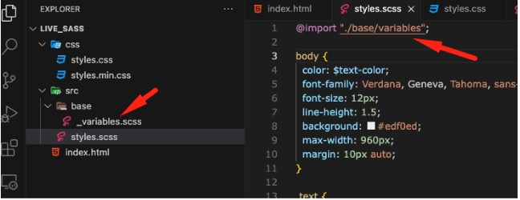
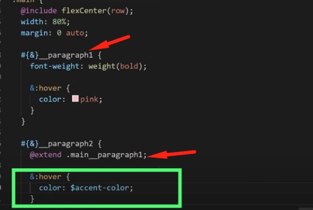
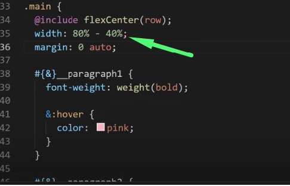

# Useful SASS commands

## Define a SASS variable

```scss
$primaryColor: #edf0ec;
```

### Example

```scss
.headline {
  color: $primaryColor;
}
```

## map-get function

Define an array for the font weights. Add the Key value pairs like JavaScript and PHP.

```scss
$font-weight: (
  "regular": 400,
  "medium": 500,
  "bold": 700,
  "extra-bold": 900,
);
```

### Example

```scss
.heading {
  font-weight: map-get($font-weight, regular);
}
```

## Nesting

```scss
.heading {
  font-size: 1.5rem;

  #{&}__italic {
    font-style: italic;
  }
}
```

### Output

```css
.heading {
  font-size: 1.5rem;
}

.heading .heading_italic {
  font-style: italic;
}
```

## Include a partial .scss file

**@import** keyword is used to add the partial files to the main(styles.scss) scss file.

**Examples of partial files names**

- \_header.scss
- \_footer.scss
- \_variables.scss



## Declare custom function

```scss
@function FUNCTION_NAME($PARAM) {
  @return <SOME VALUE>;
}
```

### Example

```scss
@function font_weight_light(){
  return 400
}

.some_class{
  font-weight: font_weight_light()
}
```

## Declare a mixin

```scss
@mixin drop-shadow($x: 0, $y: 0, $blur: 5px, $spread: 0, $alpha: 0.16) {
  -webkit-box-shadow: $x $y $blur $spread rgba(0, 0, 0, $alpha);
  box-shadow: $x $y $blur $spread rgba(54, 114, 216, $alpha);
}
```

### Example

```scss
.my_box {
  background: $primaryColor;
  @include drop-shadow();
}
```

## IF/ELSE STATEMENT

```scss
@function theme($light-theme: false) {
  @if $light-theme {
    background: #ffffff;
  } @else {
    //dark theme
    background: #333333;
  }
}
```

## For loop

```scss
@for $i from 1 through 4 {
  .some_class_#{$i} {
    transition-delay: ($i * 0.1s) + 0.15s;
  }
}
```

## Media queries

```scss
// Screensized variables
$tablet_screen_size: 576px;
$tablet_horizontal_screen_size: 767px;
$desktop_screen_size: 992px;
$large_screen_size: 1200px;

@mixin tablet {
  @media (min-width: $tablet_screen_size) {
    @content;
  }
}

@mixin tabletHorizontal {
  @media (min-width: $tablet_horizontal_screen_size) {
    @content;
  }
}

@mixin desktop {
  @media (min-width: $desktop_screen_size) {
    @content;
  }
}

@mixin largeScreen {
  @media (min-width: $large_screen_size) {
    @content;
  }
}
```

### Example

```scss
.columns {
  @include tablet {
    flex-direction: column;
  }
}
```

## Extend a class

Here we extend paragraph 2's properties from paragraph 1.



## Width calculation example

We `do not` need to write the `calc` keyword to run any calculation operation.



### Acknowledgement

- [bluewindlab.net](https://bluewindlab.net)
